# Plumeria — Kitchen • Espresso

Website for **Plumeria Cafe & Bistro**, Jessore Road, Habra, West Bengal.

### Live site: https://plumeria-cafe-habra.netlify.app

A single-page site whose hero is a scroll-driven "walk-in": as you scroll, 120
photo frames play from the street sign, through the doors, up to the counter.
After the hero it becomes a normal page with animated sections for the story,
menu, gallery, hours, reviews, contact and location.

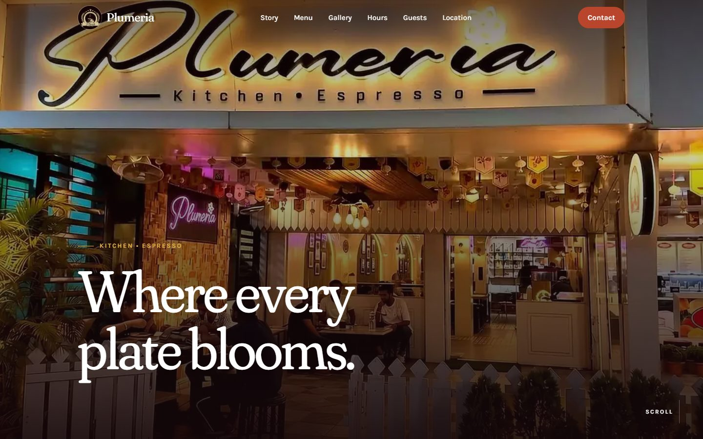

## Screenshots

| Loading screen | Hero, mid-scroll |
| --- | --- |
|  | 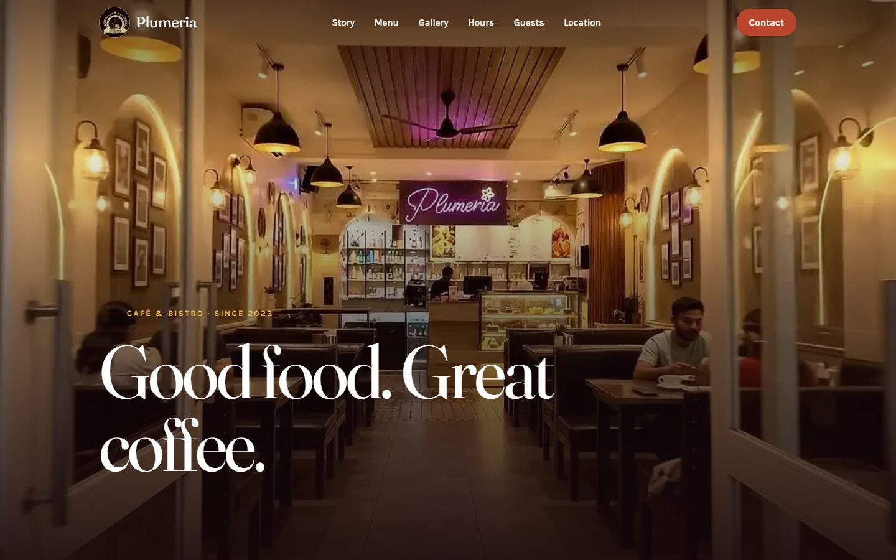 |

| Story | Highlights and "Good to know" |
| --- | --- |
| 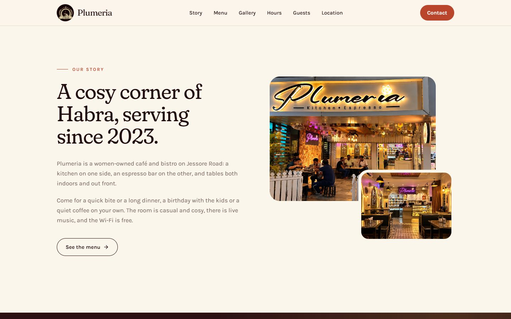 | 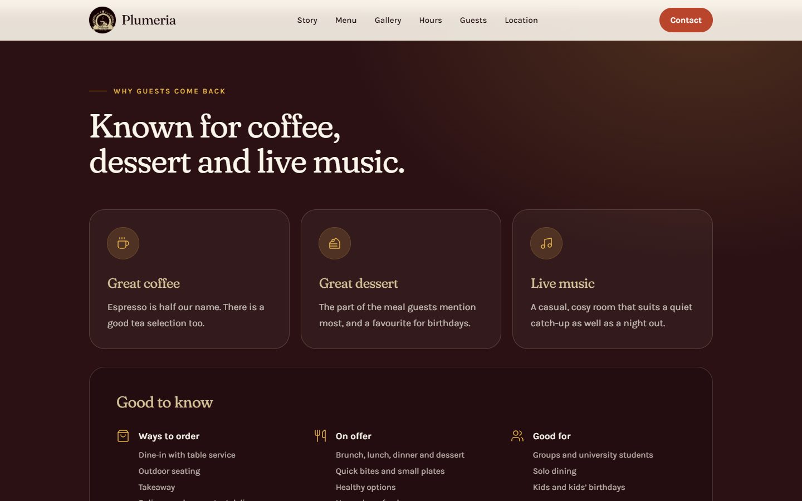 |

| Menu | Gallery |
| --- | --- |
| 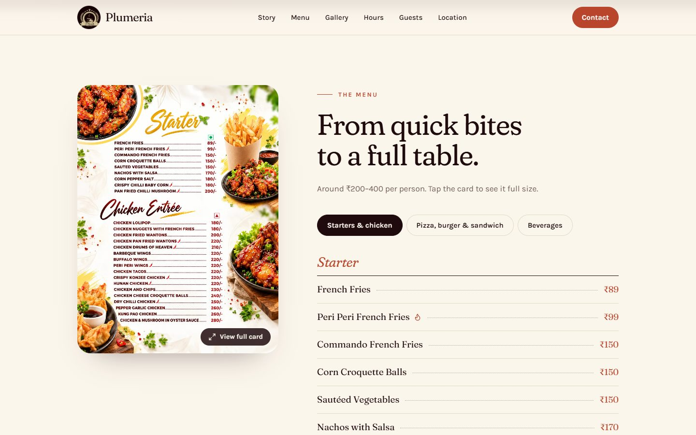 | 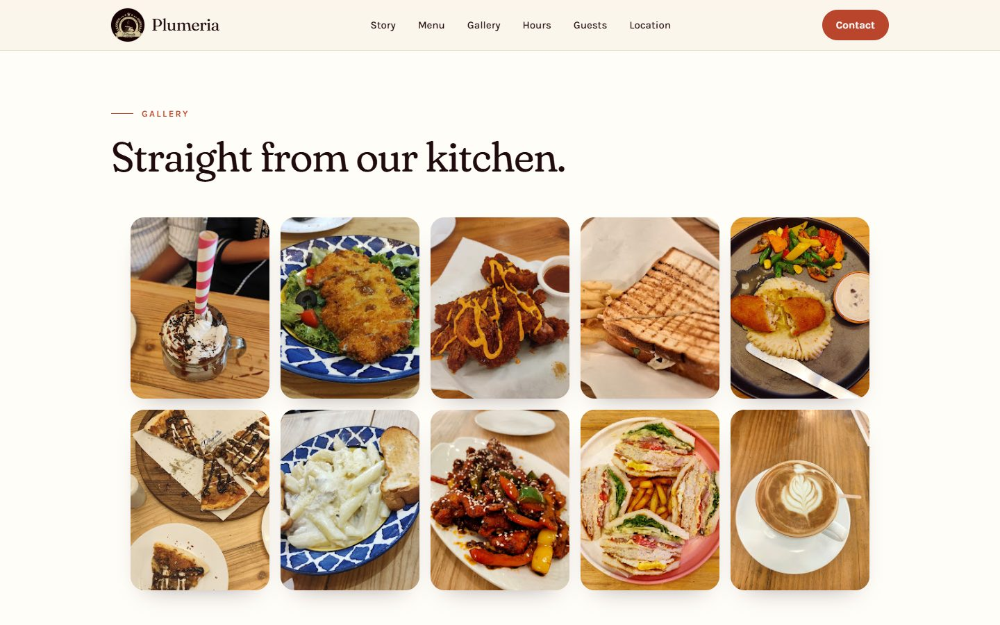 |

| Hours | Reviews |
| --- | --- |
| 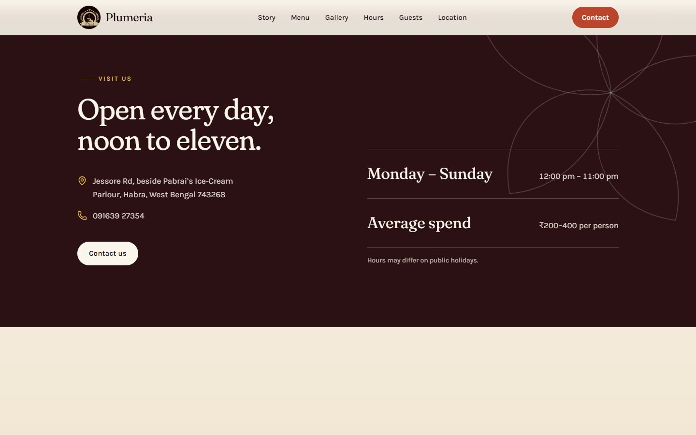 | 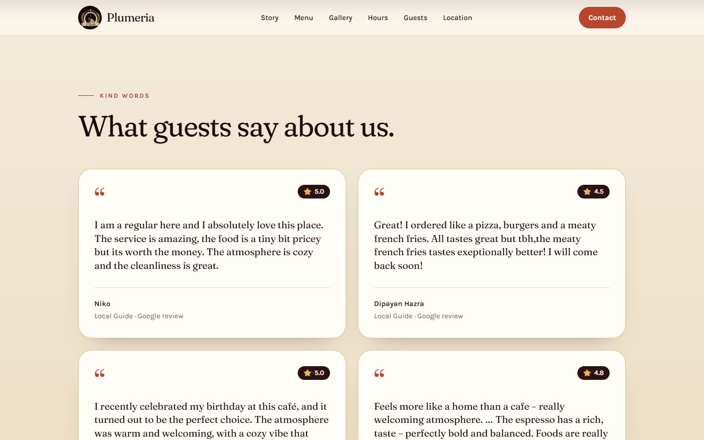 |

| Contact | Location |
| --- | --- |
| 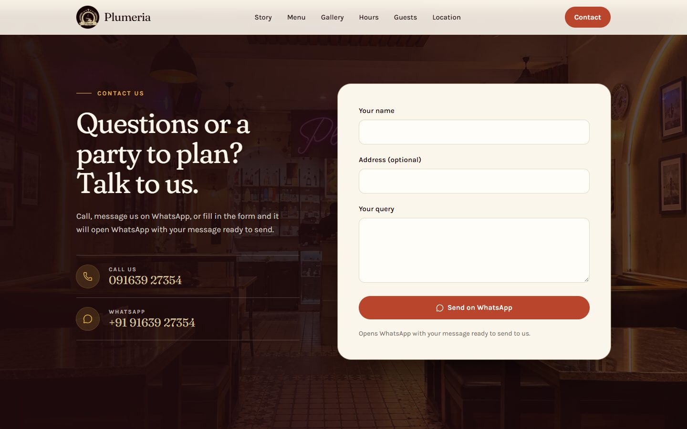 | 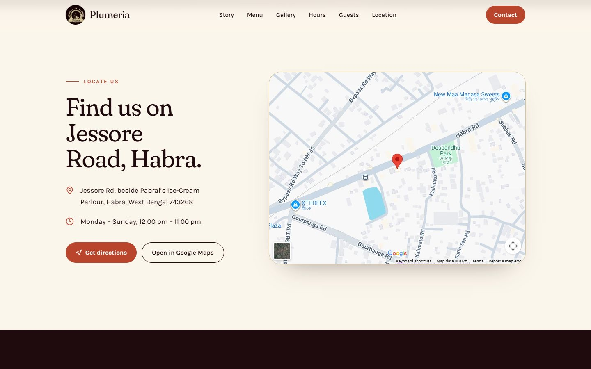 |

**On a phone**

<p>
  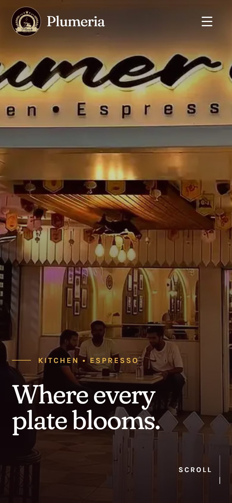
  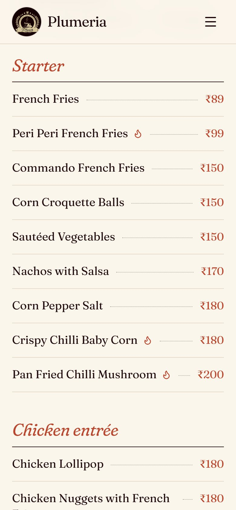
</p>

## Features

- **Scroll-driven 3D hero** — 120 frames drawn to a canvas and scrubbed by
  scroll position, with three taglines that fade in and out along the way.
  Phones and data-saver connections load every second frame to halve the download.
- **Logo loading screen** — shown for about 2.6 seconds on the first visit in a tab.
- **Real menu** — 58 items and prices transcribed from the printed cards, grouped
  into three tabs, with spicy markers and both pizza sizes. Each tab shows its
  printed card, which opens full size.
- **Gallery** of dishes, **guest reviews** from Google, and a "Good to know" panel
  (service options, accessibility, parking, payments).
- **Contact form that opens WhatsApp** with the visitor's name, address and query
  pre-filled, plus tap-to-call and tap-to-chat links. Nothing is sent to a server.
- **Location** section with an embedded Google map and a directions button.
- **Animation throughout** — smooth scrolling, word-by-word headings, staggered
  reveals, parallax photos and count-up figures.
- **Responsive** from 375 px phones to wide desktops, with a slide-down mobile menu.
- **Accessible** — keyboard-operable tabs and dialog, labelled controls, alt text,
  a skip link, and all motion switched off for visitors who prefer reduced motion.
- **Hardened** — Content Security Policy, sandboxed map embed, and security
  headers (frame blocking, HSTS, no MIME sniffing) set in `netlify.toml`.

## Built with

| | |
| --- | --- |
| Framework | [React 19](https://react.dev) + [Vite](https://vite.dev) |
| Styling | [Tailwind CSS 4](https://tailwindcss.com) |
| Animation | [GSAP](https://gsap.com) with ScrollTrigger, [Lenis](https://lenis.darkroom.engineering) smooth scroll |
| Icons | [Lucide](https://lucide.dev) |
| Fonts | Fraunces (headings) and Karla (body), from Google Fonts |
| Hosting | [Netlify](https://www.netlify.com) |

## Project structure

```
index.html              Page shell, loading screen markup, security policy
netlify.toml            Build settings and security/cache headers
vite.config.js          Vite config and the hero-frame list plugin
public/
  frames/               The 120 hero frames (frame-001.webp ... frame-120.webp)
  images/               Logo, photos, menu cards, gallery
  og.jpg                Preview image used when the link is shared
src/
  content.js            ALL text and data: menu, prices, hours, reviews, contact
  index.css             Colours, fonts and shared styles
  main.jsx              App entry and loading-screen timing
  App.jsx               Section order, smooth scrolling, scroll animations
  components/           One file per section (HeroSequence, Menu, Contact, ...)
docs/screenshots/       The images in this README
```

## Run it locally

Needs [Node.js](https://nodejs.org) 20 or newer.

```bash
npm install
```

```bash
npm run serve
```

Then open http://localhost:5173. `npm run serve` builds the site and previews it.
`npm run dev` gives live reloading, but only works when no folder in the
project's path contains a `#` character.

## Change the content

Almost everything is edited in one file, **`src/content.js`**:

| To change | Edit |
| --- | --- |
| Taglines, story, section headings | `hero`, `story`, and each section's `title` in `src/content.js` |
| Menu items and prices | `menu` in `src/content.js` |
| Hours, address, phone, map link | `hours` and `location` in `src/content.js` |
| WhatsApp number, email | `contact` in `src/content.js` (set `email` to show the email row) |
| Reviews and stats | `testimonials` and `stats` in `src/content.js` |
| Hero frames | Replace the images in `public/frames` (played in filename order) |
| Photos, logo, menu cards | Replace the files in `public/images` |
| Colours and fonts | The `@theme` block at the top of `src/index.css` |
| Loading-screen duration | `SPLASH_MS` in `src/main.jsx` |

## Deploy

The site is hosted on Netlify as `plumeria-cafe-habra`. After changing anything,
publish the new version with:

```bash
npm run deploy
```

This needs the [Netlify CLI](https://docs.netlify.com/cli/get-started/), logged in
to the account that owns the site.

## Credits

Photos, logo, menu cards and reviews belong to Plumeria Cafe & Bistro and its
guests. Site designed and built for Plumeria by Amit Das.
